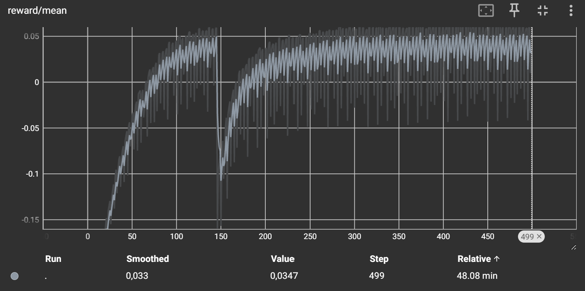
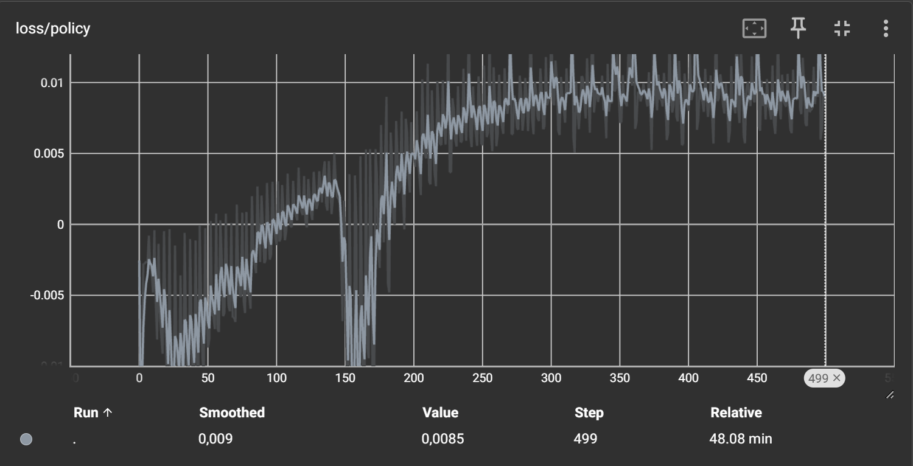
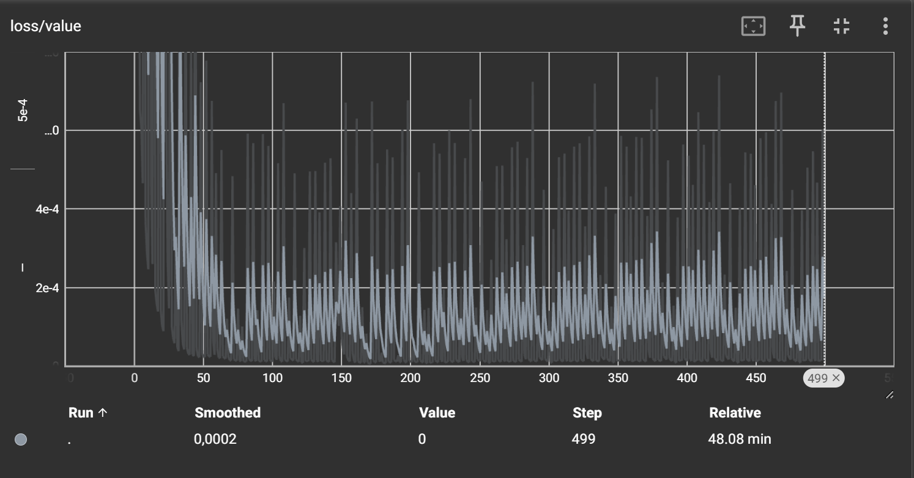

# PPO from Scratch in PyTorch with Isaac Lab

A minimal, from-scratch implementation of Proximal Policy Optimization (PPO) in PyTorch, trained on GPU-parallel environments using NVIDIA Isaac Lab. The agent runs thousands of environment instances simultaneously on a single GPU, achieving fast wall-clock training times on robotics tasks.

<p align="center">
  
</p>

## Results

Trained on `Isaac-Reach-Franka-v0` with 4096 parallel environments on an RTX 4070 SUPER. Training completed in ~48 minutes (500 iterations, 65.5M total environment steps).

### Reward Curve

<p align="center">
  
</p>

The agent starts with negative reward (arm far from target) and converges to positive reward as it learns to reach the target position. A brief policy collapse around iteration 150 is followed by a clean recovery.

### Policy Loss

<p align="center">
  
</p>

### Value Loss

<p align="center">
  
</p>

## PPO Algorithm

PPO is an on-policy, actor-critic reinforcement learning algorithm. The key idea is to constrain policy updates so the new policy doesn't deviate too far from the old one.

### Policy Objective (Clipped Surrogate)

$$L^{CLIP}(\theta) = \mathbb{E}_t \left[ \min \left( r_t(\theta) \hat{A}_t, \; \text{clip}(r_t(\theta), 1-\epsilon, 1+\epsilon) \hat{A}_t \right) \right]$$

where $r_t(\theta) = \frac{\pi_\theta(a_t | s_t)}{\pi_{\theta_{old}}(a_t | s_t)}$ is the probability ratio between new and old policies, $\hat{A}_t$ is the estimated advantage, and $\epsilon = 0.2$ is the clipping parameter.

### Generalized Advantage Estimation (GAE)

$$\hat{A}_t = \sum_{l=0}^{T-t} (\gamma \lambda)^l \delta_{t+l}$$

where $\delta_t = r_t + \gamma V(s_{t+1}) - V(s_t)$ is the TD error, $\gamma = 0.99$ is the discount factor, and $\lambda = 0.95$ is the GAE parameter.

### Value Loss

$$L^{V}(\phi) = \frac{1}{2} \mathbb{E}_t \left[ (V_\phi(s_t) - R_t)^2 \right]$$

### Entropy Bonus

$$L^{H}(\theta) = -\mathbb{E}_t \left[ \mathcal{H}[\pi_\theta(\cdot | s_t)] \right]$$

### Combined Loss

$$L(\theta, \phi) = L^{CLIP}(\theta) + c_1 L^{V}(\phi) + c_2 L^{H}(\theta)$$

with $c_1 = 0.5$ (value coefficient) and $c_2 = 0.01$ (entropy coefficient).

## Project Structure

```
PPO-from-scratch/
├── README.md
├── requirements.txt
└── src/
    ├── config.py        # All hyperparameters
    ├── env.py           # Isaac Lab environment wrapper
    ├── model.py         # Actor (Gaussian policy) and Critic networks
    ├── agent.py         # PPO algorithm: rollout buffer, GAE, clipped update
    ├── train.py         # Training loop with logging and checkpointing
    ├── eval.py          # Inference and video recording
    └── utils/
        ├── logger.py          # TensorBoard wrapper
        └── normalization.py   # Running mean/std for observation normalization
```

### Architecture

**Actor:** MLP (obs → 256 → 256 → act_dim) with Tanh activations, orthogonal initialization, and a learnable log-std parameter for the diagonal Gaussian policy.

**Critic:** MLP (obs → 256 → 256 → 1) with Tanh activations and orthogonal initialization. Separate network from the actor (no shared backbone).

## Setup

### System Dependencies

```bash
sudo apt install -y libsm6 libxt6 libxrender1 libgl1-mesa-dri libegl1 libglib2.0-0 libglu1-mesa
```

### Python Environment

Isaac Lab requires Python 3.10 or 3.11.

```bash
# Create virtual environment
python3.10 -m venv env_isaaclab
source env_isaaclab/bin/activate

# Install PyTorch (adjust for your CUDA version)
pip install torch torchvision --index-url https://download.pytorch.org/whl/cu121

# Install Isaac Lab (includes Isaac Sim, Gymnasium, and all dependencies)
pip install 'isaaclab[isaacsim,all]==2.0.2' --extra-index-url https://pypi.nvidia.com

# Install remaining dependencies
pip install tensorboard
```

### Clone and Run

```bash
git clone https://github.com/<your-username>/PPO-from-scratch.git
cd PPO-from-scratch/src
```

## Training

```bash
python train.py
```

Training runs headless with 4096 parallel environments by default. Modify `config.py` to change the task, number of environments, or hyperparameters.

To monitor training with TensorBoard:

```bash
tensorboard --logdir runs --bind_all
```

### Default Hyperparameters

| Parameter | Value |
|---|---|
| Task | Isaac-Reach-Franka-v0 |
| Parallel Envs | 4096 |
| Learning Rate | 3e-4 |
| Discount (γ) | 0.99 |
| GAE (λ) | 0.95 |
| Clip (ε) | 0.2 |
| Epochs per Update | 4 |
| Minibatch Size | 2048 |
| Horizon | 32 |
| Max Iterations | 500 |

### Checkpoints

Checkpoints are saved every 50 iterations and at the end of training:

```
checkpoint_50.pt
checkpoint_100.pt
...
final_policy.pt
```

Each checkpoint includes actor weights, critic weights, optimizer state, and observation normalization statistics.

## Evaluation

Run the trained policy and record a video:

```bash
python eval.py
```

This records an MP4 to the `videos/` directory. Note that evaluation with video recording requires the full rendering pipeline and is slower to initialize than headless training.

For headless evaluation (faster, no video):

Set `headless=True` and remove the `RecordVideo` wrapper in `eval.py`.

## Supported Environments

Any Isaac Lab environment works — just change `task` in `config.py`. Tested on:

| Task | Type |
|---|---|
| Isaac-Cartpole-Direct-v0 | Classic control |
| Isaac-Reach-Franka-v0 | Manipulation |

Other environments to try: `Isaac-Ant-Direct-v0`, `Isaac-Velocity-Flat-Anymal-D-v0` (quadruped locomotion), `Isaac-Lift-Cube-Franka-v0` (pick and place).

## Hardware

Trained and evaluated on:

- **GPU:** NVIDIA RTX 4070 SUPER (12 GB VRAM)
- **CPU:** Intel Xeon E5-2673 v4
- **Cloud:** vast.ai

Minimum requirements: any NVIDIA GPU with 12+ GB VRAM, Linux, CUDA 12+.

## References

- [Proximal Policy Optimization Algorithms](https://arxiv.org/abs/1707.06347) — Schulman et al., 2017
- [High-Dimensional Continuous Control Using Generalized Advantage Estimation](https://arxiv.org/abs/1506.02438) — Schulman et al., 2016
- [NVIDIA Isaac Lab](https://github.com/isaac-sim/IsaacLab) — GPU-accelerated robot learning framework